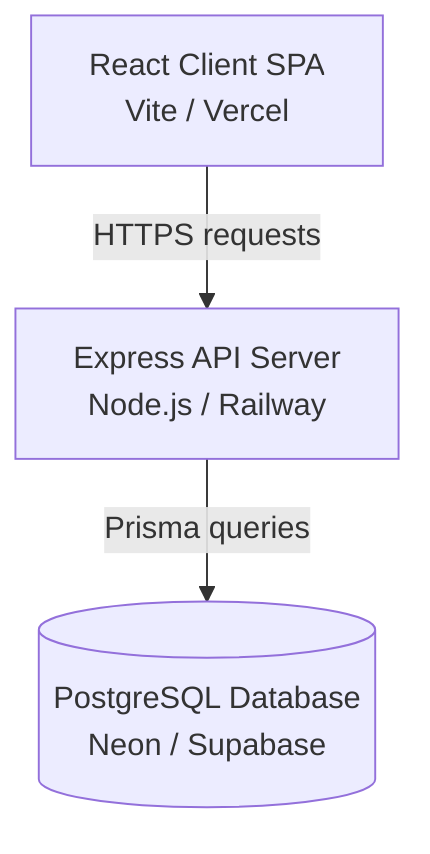

# LifeTag Production Deployment & Launch Guide

This guide outlines the step-by-step deployment procedure for the LifeTag ecosystem (React Frontend, Express Backend, Prisma ORM, and PostgreSQL Database) and assigns launch ownership across the team.

---

## 🏗️ Production Deployment Architecture



---

## 🚀 Step-by-Step Deployment Procedure

### Phase 1: Database Provisioning (Neon or Supabase)
1. **Create Instance**: Sign up on [Neon.tech](https://neon.tech/) or [Supabase](https://supabase.com/) and create a serverless PostgreSQL database named `lifetag_prod`.
2. **Retrieve Connection String**: Copy the connection string (with transaction pooling enabled if deploying to serverless environments).
   - Format: `postgresql://<USER>:<PASSWORD>@<HOST>/lifetag_prod?sslmode=require`

### Phase 2: Express Server Deployment (Render, Railway, or Fly.io)
1. **New Service**: Link the GitHub repository `https://github.com/nh-44/lifetag.git` to [Railway.app](https://railway.app/) or [Render.com](https://render.com/).
2. **Build Settings**:
   - Root Directory: `server/`
   - Build Command: `npm install && npm run build`
   - Start Command: `npm start`
3. **Environment Variables**: Add the following keys inside the deployment panel:
   - `PORT`: `5000` (or leave default if managed automatically)
   - `NODE_ENV`: `production`
   - `DATABASE_URL`: *(Your Neon Connection String)*
   - `JWT_SECRET`: *(A secure, generated 32-character random string)*
   - `CORS_ORIGIN`: *(The Vercel URL of your client after Phase 3)*
   - `AUTHORITY_PRIVATE_KEY`: *(The production JSON stringified JWK Healthcare Authority Private Key)*

### Phase 3: Prisma Migration on Production Database
1. Run migrations locally pointing to the remote production connection string to initialize the schema:
   ```bash
   cd server
   DATABASE_URL="your_production_neon_url" npx prisma db push
   ```

### Phase 4: Vite Client Deployment (Vercel or Netlify)
1. **New Project**: Link the repository to [Vercel](https://vercel.com/).
2. **Build Settings**:
   - Root Directory: `client/`
   - Framework Preset: `Vite`
   - Build Command: `npm run build`
   - Output Directory: `dist`
3. **Environment Variables**:
   - `VITE_API_URL`: *(The URL of your deployed Express server, e.g. `https://lifetag-server.up.railway.app/api/v1`)*

---

## 👥 Division of Work (Launch Day Checklist)

### 🏥 Naveen — Cryptographic & Security Lead
*   [ ] **Authority Keys**: Generate the official production P-256 Healthcare Authority key pair (do not use development fallbacks).
*   [ ] **Public Key Distribution**: Coordinate with Nandita to ensure the production public key JWK is inserted into `client/src/services/nfcCryptoService.ts`.
*   [ ] **Private Key Setup**: Hand over the production private key JWK to Preksha for inclusion in the server's production environment configuration under `AUTHORITY_PRIVATE_KEY`.

### 🛡️ Preksha — Backend Lead
*   [ ] **DB Provisioning**: Create the Neon serverless PostgreSQL database.
*   [ ] **Database Schema Build**: Push Prisma schemas and seed initial roles (`USER`, `DOCTOR`, `FIRST_RESPONDER`) using `prisma db push`.
*   [ ] **Express Deployment**: Configure the Railway/Render build pipeline, set environment variables, and verify that health checks return status `200`.

### 🎨 Nandita — Frontend Lead
*   [ ] **Client Deployment**: Deploy Vite to Vercel, pointing `VITE_API_URL` to Preksha's backend URL.
*   [ ] **CORS Configuration**: Provide the Vercel app URL to Preksha so she can update the `CORS_ORIGIN` variable on the server.
*   [ ] **Visual Validation**: Verify that UI routes render correctly, login page authenticates, and the "TrustBadge" badge renders correctly.

### 📡 Navyashree — QA & NFC Verification Lead
*   [ ] **Proximity Proof Verification**: Attempt to log a scan via `/api/v1/scans` manually without a signature to verify that server-side bypass protection blocks the request.
*   [ ] **End-to-End Test Run**: Perform physical tag scans using standard web-NFC browsers on production URLs, checking that authority certificate verification resolves to "Authority Certified".
